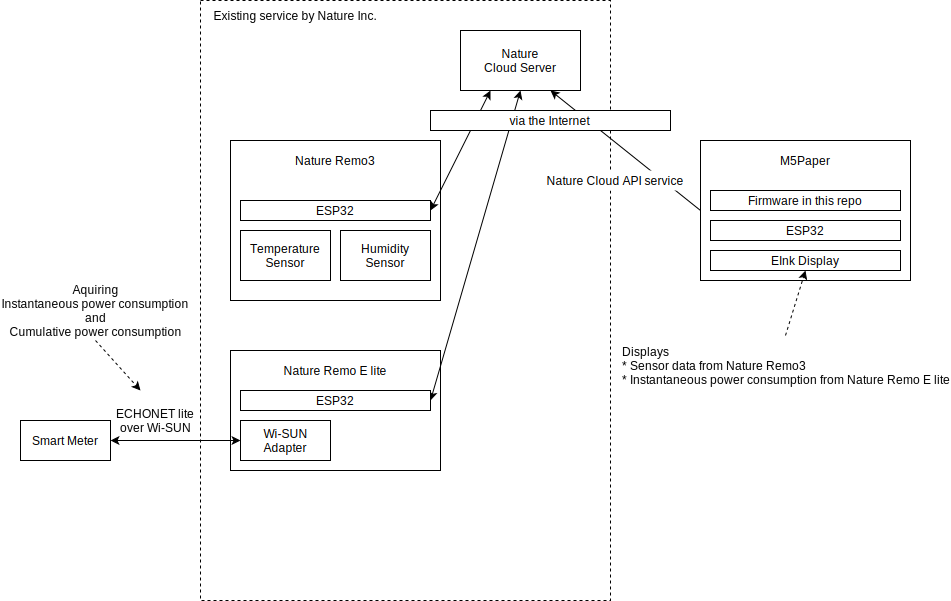

# M5Stack Monitor for Nature Remo series (unofficial)

## 概要

M5StackのEInkディスプレイ付き無線通信ユニット M5Paper を使った、Nature Remoシリーズのセンサ・データ表示器です。
Nature Remo3の温度・湿度センサ、およびNature Remo E (Lite)が計測しているスマートメーターの瞬時電力情報を、Nature Remo Cloud API経由で取得し表示します。

## システム構成



自宅にある Nature Remo3 が室温および湿度を測定し、Natureのサーバーにアップロードしています。
また、Nature Remo E liteはWi-SUNの無線通信上でECHONET Liteプロトコルを使って電力事業者が設置しているスマートメーターにBルート経由でアクセスし、瞬時電力消費量と積算電力消費量を取得し、Natureのサーバーにアップロードしています。

Natureのサーバーはサードパーティのデバイスを接続するためのサービスとして、Nature Cloud APIによるアクセスを提供しており、本リポジトリで公開しているファームウェアはこのAPI経由で上記2つのデバイスがアップロードした情報を取得します。
また、取得した情報をもとにM5Paperに搭載されているEInkディスプレイに現在値および最大過去24時間分の変化をグラフ表示します。

## ファームウェア構成

M5Paper上のファームウェアは、前述の通り、

* NatureサーバーにNature Cloud API経由でアクセスして情報を取得
* 取得した情報をEInkディスプレイに表示

の2つの処理を行います。

これらの処理は、いくつかのライブラリやフレームワークを用いて実装されています。


### Rust

本ファームウェアは一部を除いて主要な処理はRustで記述しています。

### ESP-IDF

ESP32の開発元であるEspressifが開発しているESP32向けのソフトウェア開発環境です。ESP32シリーズ向けのファームウェアをC言語およびC++言語にて開発するための各種ライブラリおよびツールチェインを提供します。
また、後述する esp-idf-sys などを組み合わせることにより、Rustによるファームウェア開発も可能です。

### esp-idf-sys

主にEspressifにより開発されている、ESP-IDFの機能をRustから使うためのクレート (Rustのライブラリ) です。
ESP-IDFのAPIをRustから呼び出すためのcffiによるバインディングが含まれています。

また、ESP32向けのRust環境は、ESP-IDFと合わせてビルドされることが前提となっており、そのためにESP-IDFのビルドシステムを呼び出して最終的なファームウェアのバイナリを生成する機能も `esp-idf-sys` により提供されます。

### ESP32 std

Rustのツールチェインはプラットフォーム依存部分をstdクレートとして各種プラットフォーム向けに用意しています。ESP32 stdはESP-IDF環境向けのstdクレートで、ESP32向けのRustツールチェインに含まれています。

### esp-idf-svc

esp-idf-sysが提供するESP-IDFのバインディングはESP-IDFのAPIをRustから呼び出せるようにするだけのものなので、Rustから呼び出すのは安全ではありません。
esp-idf-svcはこれらの機能をRustから安全に呼び出せるようにするためのラッパーを提供します。

esp-idf-svcの機能により、ESP32の無線通信機能などをRustから簡単に使えるようになります。

### LovyanGFX

高性能な組込み向けの表示デバイスドライバ、および描画機能を提供するライブラリです。M5Paperに搭載されているEInkディスプレイ **EPD_ED047TC1** の制御に使います。
C++で実装されており、ESP-IDF上で動作します。

### lgfx-rs

LovyanGFXをRustから呼び出すためのバインディングおよびラッパーを提供します。現在のところ本ファームウェアで必要となる程度のLovyanGFXの機能に対するラッパーのみ提供しています。

### fuga-remo-api

RustでNature Cloud APIからのレスポンスを処理するためのパーサー。

### fuga-json-seq-parser

ESP32のような使用可能なRAMの量に制限のあるデバイス上で、比較的サイズの大きいJSONをパースするためのクレート。fuga-remo-apiの実装につかっています。

## ファームウェアの処理

ファームウェアの処理は主に2つのタスクに分かれています。

### Nature Cloud API通信処理

Nature Cloud API経由で情報を取得します。
HTTPSにてサーバーに接続し、返ってきたレスポンスを前述の fuga-remo-api を用いて解析し、対象となるセンサー情報や電力消費量の情報を抽出します。

抽出した情報はキュー経由でディスプレイ表示処理に送られます。

Cloud APIの通信処理に関しては、 [こちらのブログ記事](https://engineering.nature.global/entry/2022/12/13/121813) にも記載しています。

### ディスプレイ表示処理

前述のCloud API通信処理から送られてきた情報をもとに、 lgfx-rsからLovyanGFXのディスプレイ・ドライバを呼び出して、現在の室温・気温・瞬時電力の値および時系列のグラフを描画します。

# ビルド手順

## ESP32向けRust環境の構築

esp-idf-templateリポジトリのprerequisitesに記載されている手順でESP32向けRust環境を構築しておきます。

https://github.com/esp-rs/esp-idf-template#prerequisites

## リポジトリのclone

本リポジトリを以下のコマンドでcloneしておきます。

```shell
git clone https://github.com/ciniml/m5stack-remo-monitor
cd m5stack-remo-monitor
```

## 設定ファイルの作成

現在のところ、Nature Remo Cloud APIに通信するためのアクセス・トークンおよび、センサ取得対象のデバイスの設定は `src/config.rs` に定義した定数を用いています。
config.rsを作成するためのひな型として、 `src/config.rs.template` がありますので、`src/config.rs` としてコピーして中身のテンプレートにしたがって必要な情報を埋めます。

```Rust
use uuid::{uuid, Uuid};

pub const WIFI_AP: &str = "wifi ap";
pub const WIFI_PASS: &str = "wifi pass";
pub const ACCESS_TOKEN: &str = "cloud api access token";

pub const SENSOR_REMO_DEVICE_ID: Uuid  = uuid!("sensor remo device id");
pub const ECHONETLITE_APPLIANCE_ID: Uuid = uuid!("echonet lite appliance id");
```

Cloud APIのアクセストークンの取得や、RemoのデバイスIDやアプライアンスIDの取得に関しては、 [Node-REDで行う例の解説](https://engineering.nature.global/entry/node-red_cloud-api_1) がありますので、こちらを参考にしてください。

## ビルドと書き込みおよび実行


M5Paper向けにビルドするには、以下のコマンドを実行します。

```shell
make build-device
```

今のところ、内部的には、 `cargo build --release` を呼んでいるだけです。

x64上のLinux向けにビルドするには、以下のコマンドを実行します。

```shell
make build-linux
```

M5Paper向けに書き込みおよび実行をするには、以下のコマンドを実行します。
M5PaperをUSBケーブルで接続しておく必要があります。

```shell
make run-device
```

Linux上で動かしたい場合は、以下のコマンドを実行します。

```shell
make run-linux
```

# ライセンス

本リポジトリに含まれるソースコードは MIT License のもとで使用できます。
また、submoduleでインポートしているリポジトリに含まれるソースコードは、それぞれのリポジトリに含まれるライセンスに従います。